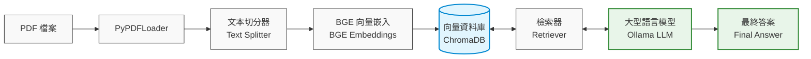

# Local PDF RAG Assistant (FastAPI + Ollama + ChromaDB)

A Retrieval-Augmented Generation (RAG) system built with FastAPI, ChromaDB, Ollama, and HuggingFace Embeddings. Users can upload PDF documents, automatically generate vector embeddings, store them in a vector database, and perform question-answering based on document contents.

---

# Project Overview

This project demonstrates the implementation of an end-to-end AI backend application that combines:

- FastAPI REST API
- PDF document ingestion
- Text chunking
- Vector embeddings
- ChromaDB vector database
- Retrieval-Augmented Generation (RAG)
- Ollama local LLM inference
- Docker containerization
- GitHub Actions CI pipeline

The system allows users to upload PDF files and ask natural language questions grounded in the document content.

---

# System Architecture

```text
                ┌─────────────────┐
                │     PDF File    │
                └────────┬────────┘
                         │
                         ▼
                ┌─────────────────┐
                │  PyPDFLoader    │
                └────────┬────────┘
                         │
                         ▼
                ┌─────────────────┐
                │  Text Splitter  │
                └────────┬────────┘
                         │
                         ▼
                ┌─────────────────┐
                │  BGE Embeddings │
                └────────┬────────┘
                         │
                         ▼
                ┌─────────────────┐
                │    ChromaDB     │
                └────────┬────────┘
                         │
                         ▼
                ┌─────────────────┐
                │    Retriever    │
                └────────┬────────┘
                         │
                         ▼
                ┌─────────────────┐
                │   Ollama LLM    │
                └────────┬────────┘
                         │
                         ▼
                ┌─────────────────┐
                │  Final Answer   │
                └─────────────────┘
```



---

# Tech Stack

## Backend

- FastAPI
- Pydantic
- Uvicorn

## LLM & RAG

- LangChain
- Ollama
- ChromaDB
- HuggingFace Embeddings
- BAAI/bge-small-en-v1.5

## Document Processing

- PyPDF
- RecursiveCharacterTextSplitter

## DevOps

- Docker
- Docker Compose
- GitHub Actions

---

# Project Structure

### 專案資料夾結構

```text
pdf-rag/
├── app/                        # 應用程式核心程式碼
│   ├── api/                    # API 路由與控制器
│   │   └── rag.py                # RAG 相關 API 接口
│   ├── db/                     # 資料庫連接與設定
│   │   └── chroma_client.py      # ChromaDB 客戶端初始化
│   ├── models/                 # 資料模型與 Schema
│   │   └── schemas.py            # Pydantic 或資料驗證模型
│   ├── services/               # 核心業務邏輯
│   │   ├── rag_service.py        # RAG 檢索與生成邏輯
│   │   └── prompt.py             # 提示詞（Prompt）模板管理
│   └── main.py                 # 應用程式啟動入口
├── chroma_langchain_db/        # ChromaDB 本地持久化數據儲存目錄
├── uploaded_pdfs/              # 暫存使用者上傳的 PDF 檔案目錄
├── Dockerfile                  # Docker 映像檔構建設定
├── docker-compose.yml          # 多容器（FastAPI + Chroma）編排設定
├── requirements.txt            # Python 依賴套件清單
└── README.md                   # 專案說明文件
```


---

# Features

## PDF Upload

Upload PDF documents via REST API.

```http
POST /rag/upload
```

Example:

```bash
curl -X POST \
  "http://localhost:8001/rag/upload" \
  -F "file=@paper.pdf"
```

---

## Vector Indexing

The uploaded PDF is automatically:

1. Parsed
2. Split into chunks
3. Converted into embeddings
4. Stored in ChromaDB

---

## Document Question Answering

Ask questions against a specific indexed PDF.

```http
POST /rag/ask
```

Request:

```json
{
  "filename": "RAGpaper.pdf",
  "question": "What is Retrieval-Augmented Generation?"
}
```

Response:

```json
{
  "filename": "RAGpaper.pdf",
  "question": "What is Retrieval-Augmented Generation?",
  "answer": "Retrieval-Augmented Generation (RAG) is..."
}
```

---

# RAG Workflow

## Step 1: Upload Document

```python
loader = PyPDFLoader(pdf_path)
docs = loader.load()
```

---

## Step 2: Text Chunking

```python
RecursiveCharacterTextSplitter(
    chunk_size=1000,
    chunk_overlap=200
)
```

---

## Step 3: Embedding Generation

```python
HuggingFaceEmbeddings(
    model_name="BAAI/bge-small-en-v1.5"
)
```

---

## Step 4: Vector Storage

```python
vector_store = Chroma(
    collection_name="local_rag_collection",
    embedding_function=embeddings,
    persist_directory=DB_PATH,
)
```

---

## Step 5: Similarity Retrieval

```python
vector_store.similarity_search(
    question,
    k=4,
    filter={"source_file": filename}
)
```

---

## Step 6: LLM Generation

```python
llm = Ollama(
    model="llama3",
    base_url="http://ollama:11434"
    )
```

---

# API Documentation

After the application starts successfully:

```text
http://localhost:8001/docs
```

Swagger UI is automatically generated by FastAPI.

---

# Running Locally

## Clone Repository

```bash
git clone https://github.com/WalterOuO/Local_PDF_RAG_Assistant.git
cd pdf-rag
```

---

## Install Dependencies

```bash
pip install -r requirements.txt
```

---

## Ollama Setup

This project uses Ollama as the local LLM runtime.

Make sure Ollama is installed and running:

```bash
ollama pull llama3
```

Start Ollama server:

```bash
ollama serve
```

Default endpoint:
```
http://localhost:11434
```

---

## Run FastAPI

```bash
uvicorn app.main:app --reload
```

---

# Docker Deployment

## Build

```bash
docker compose up -d --build
```

---

## Verify

```bash
docker ps
```

---

## Open Swagger

```text
http://localhost:8001/docs
```

---

# CI Pipeline

GitHub Actions is configured to automatically:

- Install dependencies
- Validate project imports
- Build and deploy Docker container

Pipeline file:

```text
.github/workflows/ci.yml
```

---

# Challenges Solved

### Multi-Document Isolation

Each chunk is tagged with metadata:

```python
chunk.metadata["source_file"] = filename
```

This prevents retrieval from unrelated documents.

---

### Duplicate PDF Detection

Before indexing:

```python
vector_store.get(
    where={"source_file": filename}
)
```

Avoids repeated embedding generation.

---

### Hallucination Reduction

Prompt engineering enforces grounded answers:

```text
If the answer cannot be found in the provided context,
respond that the answer is unavailable in the document.
```

---

# Future Improvements

- Hybrid Search (BM25 + Vector Search)
- Reranking Models
- Streaming Responses
- Multi-PDF Question Answering
- Redis Caching
- RAG Evaluation (RAGAS)
- Authentication & User Management
- PostgreSQL Metadata Storage
- Kubernetes Deployment

---

# Skills Demonstrated

## Backend Development

- FastAPI
- REST API Design
- Dependency Management
- Service-Oriented Architecture

## AI Engineering

- RAG Pipeline
- LangChain
- LLM Integration
- Prompt Engineering
- Embeddings
- Vector Databases

## DevOps

- Docker
- CI/CD

